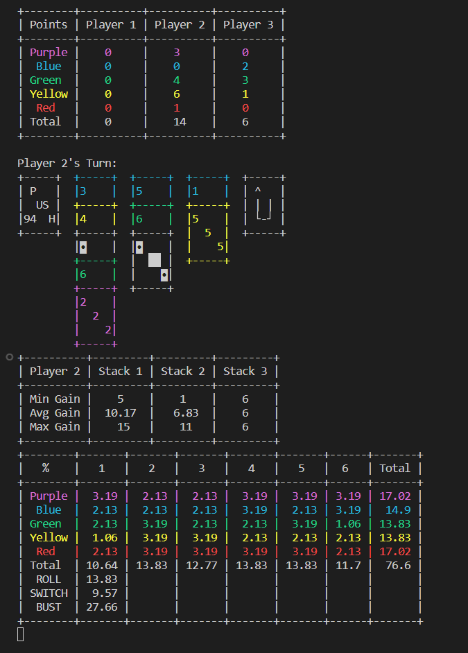

# PUSH Simulator
#### Requirements
* Python 3
* PrettyTable

### Run
`python3 push.py`

### Config
Set simulation speed by modifying `timescale` in push.py. 1=realtime, 0=instant

To create your own AI, create a new py file and copy code from `Player_IDK.py`, replace code in defined methods.

## Example Output
